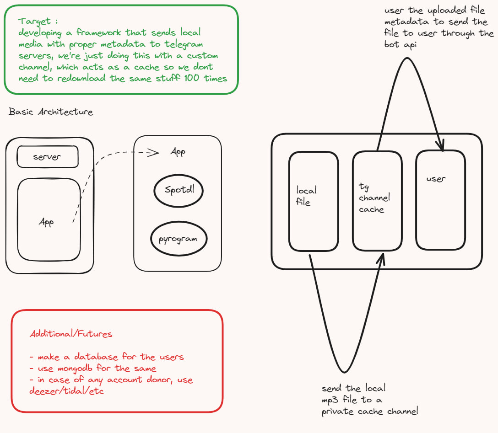

# Media Server

## About :
This was taken as a side project to learn how the pyrogram framework works
The goal was to learn to send local media to telegram servers and provided to users through a bot

## How to use :
**To be honest just hmu on whatsapp and I'll help you out**
- Clone the repo
- Make sure you are on python 3.10.12 since that is the version I'm building this on
- Setup a virtual environment using `pipenv create`
- Activate the virtual environment using `pipenv shell`
- Install the dependencies using `pipenv install`
- Create a `config.env` file and add the following variables
    - `API_ID` : Your api id from my.telegram.org
    - `API_HASH` : Your api hash from my.telegram.org
    - `BOT_TOKEN` : Your bot token from @BotFather
    - `SESSION_NAME` : A session name for your bot
    - `SUDO_ID` : A comma seperated list of user ids who can use the bot
    - `OWNER_ID` : A comma seperated list of owner ids who can use the bot

## TODO :
- [x] Integrate spotdl
- [x] Make a basic bot
- [ ] Figure out integrating mongodb
- [ ] Send local media to telegram cache channel
- [ ] Get the file_id of the media and send forward it to the user
- [ ] Make a database to log the userstats
- [ ] Integrate inline spotdl

## Disclaimer :
This repository is for research purposes only, the use of this code is your responsibility. I take no responsibility and/or liability for how you choose to use any of the code available here. By using any of the files available here, you understand that you are agreeing to use at your own risk. Once again, all files available in this repository are for educational and/or research purposes only.